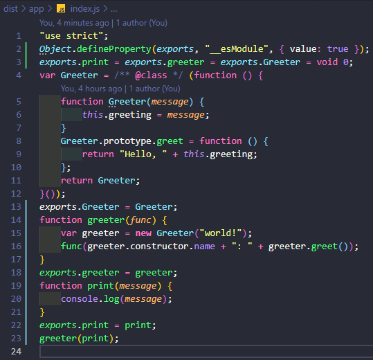

# TypeScriptCodex
## 轉譯結果



## 操作指令
```
npm init
npm i -D rollup typescript
npm i -D @open-wc/building-rollup rimraf deepmerge
```

### 產生 tsconfig.json 範本
```
tsc --init
```

### 轉譯並執行
```
npm run build
npm start
```

## rollup.js
[Installing Rollup locally - rollup.js](https://rollupjs.org/guide/en/#installing-rollup-locally)  
[Awesome Rollup](https://github.com/rollup/awesome)

## TypeScript
[TypeScript: Documentation - tsc CLI Options](https://www.typescriptlang.org/docs/handbook/compiler-options.html)  
[TypeScript: TSConfig Reference - Docs on every TSConfig option](https://www.typescriptlang.org/tsconfig#include)  
[TypeScript: Handbook - Classes](https://www.typescriptlang.org/docs/handbook/classes.html)

## 參考文章
[Building: Rollup: Open Web Components](https://open-wc.org/docs/building/rollup/)  
[How to Setup a TypeScript project using Rollup.js - This Dot Labs](https://www.thisdot.co/blog/how-to-setup-a-typescript-project-using-rollup-js)
